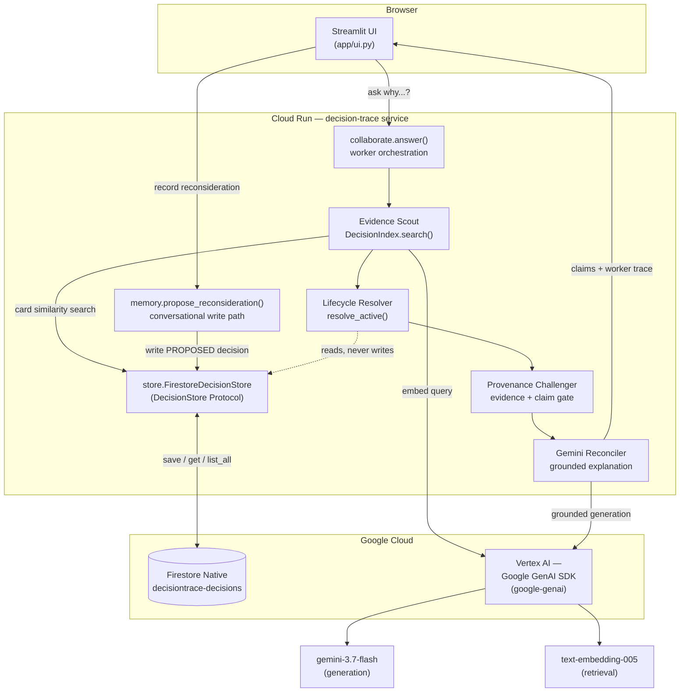

# DecisionTrace architecture

Matches what's actually running in `app/*.py` and deployed to Cloud Run —
not an idealized target architecture. Component names below are the real
module/class names in the repo.

## System diagram

## Why the pieces are shaped this way

- **`graph.resolve_active()` is deterministic code, not an LLM call.**
  BUILD_SCOPE's one non-negotiable: a reverted/superseded decision must
  never be presented as current guidance. That's a graph traversal over
  typed edges (`supersedes`, `reverts`, `reaffirms`, `reconsiders`, ...),
  replayed in stable topological order — not something delegated to Gemini's
  judgment, because an LLM can be argued into hallucinating a wrong
  current-status under the right prompt pressure. Cycles and competing
  successors are returned as ambiguous instead of being last-writer wins.

- **The answer path has four explicit workers.** The Evidence Scout retrieves
  cards, the Lifecycle Resolver supplies deterministic status, the Provenance
  Challenger removes records without source evidence and validates model claim
  IDs, and the Gemini Reconciler explains the surviving evidence. Their
  answer-scoped reports are rendered in the UI; they do not create a second
  persistent state model.

- **`store.DecisionStore` is a `Protocol`, not a concrete dependency.**
  `JSONFileDecisionStore` (local file, zero GCP dependency) and
  `FirestoreDecisionStore` (real Firestore, used in production) both
  satisfy the same four-method interface. Every caller — `graph.py`,
  `retrieval.py`, `collaborate.py`, `memory.py`, `ui.py` — depends on the
  Protocol, never on which implementation is behind it. This is what let
  the Firestore swap land without touching any of those callers.

- **Retrieval embeds decision *cards*, not raw source documents.** The
  falsifier (`RESULTS.md`) showed embedding search collapsing specifically
  on long, template-structured raw documents (KEP files) — the query
  retrieves a relevant-looking chunk that isn't the chunk carrying the
  actual current rationale. Embedding the already-extracted, uniform
  decision cards instead of the raw documents is the direct fix the
  falsifier's failure mode pointed at.

- **Every `RetrievalCandidate` carries its own `ActiveResolution`.** There
  is no code path in `retrieval.py` that returns a `Decision` without also
  resolving whether it's currently active — so `collaborate.py` can never
  accidentally hand Gemini a stale decision framed as current.

## Data flow: the two paths that matter

**Read path** (`ask why...`): UI → `collaborate.answer()` → Evidence Scout
(`retrieval.DecisionIndex.search()`) embeds the query via Vertex AI, ranks
cards against `FirestoreDecisionStore`, and hands them to the Lifecycle
Resolver (`graph.resolve_active()`). The Provenance Challenger rejects
evidence-less/ambiguous authority and constrains claim IDs to the candidate
set. The Gemini Reconciler then tags claims as verified historical fact,
current active decision, inferred advice, or missing/uncertain. The UI renders
the answer, worker trace, deterministic lifecycle explanation, timeline, and
evidence citations together.

**Write path** (`record a reconsideration`): UI form submit →
`memory.propose_reconsideration()` constructs a new `Decision` with
`current_status = PROPOSED` and a `reconsiders` edge to the target →
`FirestoreDecisionStore.save()` persists it → `retrieval.DecisionIndex`
is reindexed in-process so the next query sees it immediately. The
proof that this write is real, not a demo trick, is a genuine
kill-and-restart test: create the candidate, kill the process, start a
fresh process with a fresh Firestore client, confirm the candidate is
still there and still shapes the next answer.

## Deployment

`Dockerfile` packages `app/` plus the root-level `vertex.py`/`gh_util.py`
helper modules and the frozen `data/decisions.jsonl` seed corpus. Built and
deployed via `gcloud run deploy --source .`, which builds remotely through
Cloud Build (local `docker build` isn't required and wasn't reliable on
every dev machine tested). Cloud Run injects `PORT`; the container's
`CMD` starts Streamlit bound to `0.0.0.0:$PORT`. `DECISIONTRACE_STORE=firestore`
is the switch that makes `ui.py` instantiate `FirestoreDecisionStore`
instead of the local-dev-only `JSONFileDecisionStore`.
