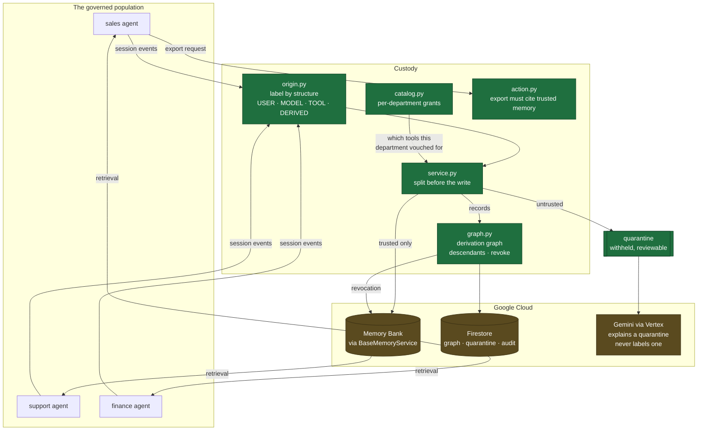
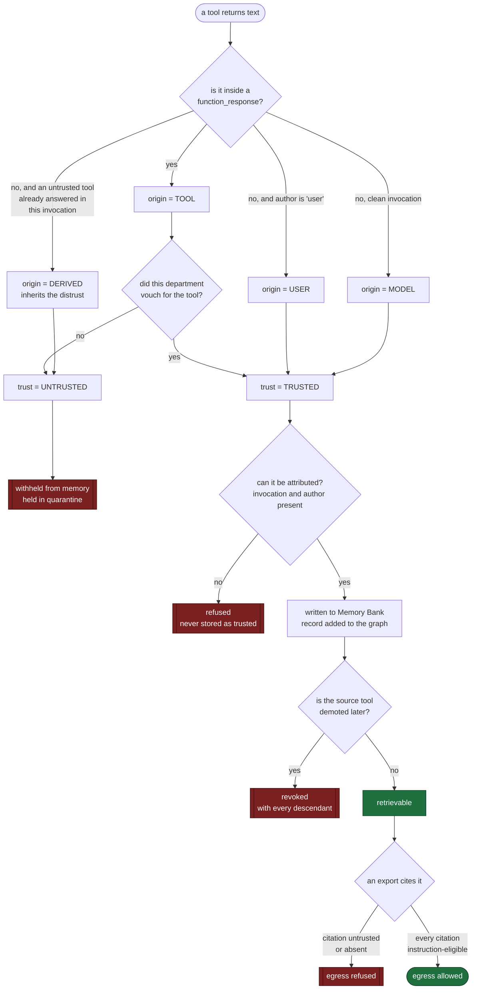

# Architecture

Two diagrams. The first is what the system is made of. The second is the path a
single piece of content takes, and every place that path can be stopped.

Committed as Mermaid source rather than an image, so it stays correct when the
design moves and renders on GitHub with no toolchain.

## What it is made of

Green is built and tested. Amber needs the cloud account.

## The path one piece of content takes

Every branch below is a place the content can be stopped, and each is a test.

## The two rules worth knowing

**Taint crosses events, inside an invocation.** A model turn following an
untrusted tool response is `DERIVED`. When an agent summarises a hostile page,
the summary is what survives into memory and the raw response is discarded, so
labelling only raw tool output would let the laundered copy through. Custody is
therefore taken over the whole session in one pass, never per event.

**Enforcement is at the write, not at retrieval.** Memory Bank derives memories
server-side, so a stored memory is not byte-identical to any event and cannot be
matched back to a custody record afterwards. A memory derived from mixed-trust
events has no single origin at all, because the derivation destroys the
provenance. Splitting before the write also means retrieval needs no filter,
which is fortunate: `search_memory(app_name, user_id, query)` does not offer one.
